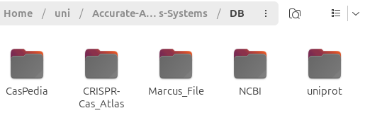

# Accurate Annotation of CRISPR-Cas Systems

This work was part of my Bachelor's Thesis. The objective was to expand the [CRISPRcasIdentifier](https://github.com/BackofenLab/CRISPRcasIdentifier) so that it can accurately annotate CRISPR-Cas Type V Cas12 subtypes.

## Python Dependencies

To execute the developed scripts, several Python modules and external bioinformatics tools were required. The following sections provide an overview of the dependencies used in the project.

### Standard Library Modules

The implementation primarily relies on Python’s standard library, which provides essential functionality for file handling, system interaction, and concurrent processing. The following modules were utilized:

* `os`, `sys`, `pathlib`, `shutil` – for file and directory management as well as system-level operations.
* `time`, `datetime` – for runtime measurement and timestamp generation.
* `subprocess` – to execute external tools such as MUSCLE and BLAST from within the Python environment.
* `csv` – for structured data export and logging of intermediate results.
* `re` – for regular expression-based pattern matching and string processing.
* `logging` – for structured logging of program execution and error handling.
* `collections` (`defaultdict`) – for efficient handling of grouped data structures.
* `concurrent.futures` (`ProcessPoolExecutor`, `ThreadPoolExecutor`, `as_completed`) – for parallel execution of computationally intensive tasks to improve performance.

### Third-Party Python Packages

In addition to the standard library, several third-party packages were employed to support bioinformatic data processing and visualization:

* **Biopython (`Bio`)** – used extensively for sequence manipulation and phylogenetic analysis:

  * `Bio.SeqIO` – sequence input and output in various file formats.
  * `Bio.Seq` – sequence object representation and manipulation.
  * `Bio.Entrez` – access to the NCBI Entrez database.
  * `Bio.AlignIO` – reading and writing multiple sequence alignments.
  * `Bio.Phylo` and `Bio.Phylo.TreeConstruction` – construction and handling of phylogenetic trees.
* **matplotlib.pyplot** – for visualization of phylogenetic trees and related plots.
* **pandas** – for data manipulation and tabular data analysis.

### External Command-Line Tools

Several external bioinformatics tools were integrated into the workflow to perform core sequence analysis tasks. These tools were executed via Python’s `subprocess` module.

* **MUSCLE** – for performing multiple sequence alignments.
* **BLASTP** – for protein sequence similarity searches against protein databases.
* **TBLASTN** – for translated searches of protein queries against nucleotide databases.
* **CD-HIT** – for clustering protein sequences and removing redundancy.
* **Prodigal** – for accurate gene prediction in prokaryotic genomes.
* **HMMER suite** (`hmmbuild`, `hmmsearch`) – for constructing and searching Hidden Markov Models (HMMs) in protein sequence datasets.

## Workflow

1. Download all necessary data from NCBI, UniProt, CRISPR-Cas Atlas, and CasPedia. The provided file "Marcus_File.fasta" should also be included.
2. Place all files into the directory `DB/` as shown in the example image below.
   
3. Run `all_pipes.sh` to process the data. This creates:

   * `FASTA/` (interim results)
   * `DataModel/` (contains a large and a small data model; the small model is more extensively filtered)
4. Run `check_pipe.py` to deduplicate sequences and sort them by subtype into separate files.
5. Generate multiple sequence alignments (MSAs) and phylogenetic trees using `phylotree_generator.py`.
6. Create HMMs using `create_hmm.py`.
7. Add the generated HMMs to CRISPRcasIdentifier for annotation.
